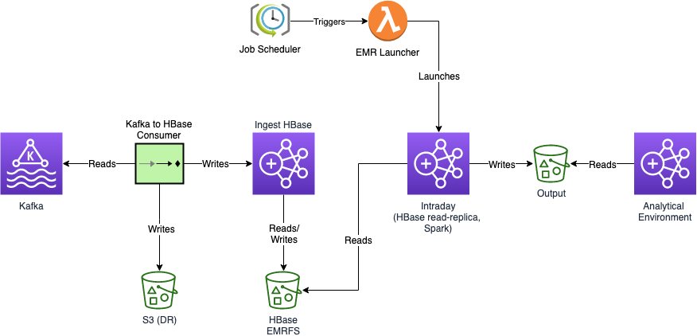

# DO NOT USE - MIGRATED TO GITLAB

# dataworks-aws-ingest-replica
The Intraday cluster is a read-replica of ingest-hbase.   
Records are read from the replica cluster, decrypted in memory and stored in s3
using DKS.  Encryption in s3 is handled by the EMR Security Configuration.

Limitations:
- During testing in preprod, inconsistencies occurred in the primary HBase. 
  It's not yet clear whether these were caused by the intraday testing.  See [here](docs/inconsistencies)
- AWS implementation of HBase read-replicas made changes to the `meta` table.  This results in incompatibility
  with standard HBase APIs/libraries.  The records are currently extracted via hbase CLI.  There are no performance
  issues at the expected volumes for intraday data, but if significant increases are expected then the solution
  may need re-evalutating.
- AWS implementation of HBase read-replicas create a folder for each new replica in the hbase root directory.
  This can cause instability in the primary cluster.
  See [here](docs/inconsistencies.md) for more information

Other documentation:
- [Adding/removing collections to intraday](docs/collection_changes.md)
- [Inconsistencies/Preprod Testing](docs/inconsistencies.md)

# Overview

1. A cloudwatch cron rule is used to trigger a lambda function
1. The lambda function checks dynamodb for job details and determines whether the Intraday cluster should be launched
1. The Intraday EMR Cluster launches as a read-replica for ingest-hbase
1. Data is extracted from hbase and processed in pyspark (decrypted, collated and output to S3)
1. Hive tables are created over the data in S3.  Views to provide the latest of each record are also created

## Scheduling and HBase Maintenance
The Intraday Schedule is designed to process data hourly during the working day, exluding the HBase maintenance windows.
HBase maintenance is documented in the internal-compute repo, and started/stopped by
[concourse jobs](https://ci.dataworks.dwp.gov.uk/teams/utility/pipelines/ingest-emr-scheduled-tasks)

Intraday scheduling is achieved using cloudwatch cron rules to trigger the Intraday lambda.

## Job Tracking

The dynamodb table `intraday-job-status` records details for each collection processed, including:
- Correlation ID, job triggered time, job status, timestamp of last record processed, emr ready time

If a scheduled cluster is already running when the job is triggered, the lambda will try waiting for 
approx. 15 minutes before timing out.  If the running cluster later completes successfully, this will not prevent 
subsequent launches.

If a scheduled cluster fails during launch or processing, subsequent clusters will not launch until the dynamodb
`JobStatus` is updated (i.e. from `FAILED` -> `_FAILED`).  This is to provide time for troubleshooting and resolution
of the error.

## Metadata Removal Lambda
HBase read-replica clusters are not able to write/modify the data stored in HBase, but they do create folders in the
hbase root directory to manage a copy of the metadata.  A directory is created for each cluster launched, and left
behind after termination.

These directories cause "inconsistencies" in the main cluster, which identifies the files as data for which it has no
metadata.  To avoid inconsistencies being reported in the ingest-hbase cluster, the replica metadata is purged by lambda
at the termination of each replica cluster.

## Logs
Logs are collected in cloudwatch under `/app/ingest-replica-incremental/`

## Concourse Pipelines
The is a concourse pipeline for intraday named `dataworks-aws-ingest-replica`, defined in the `ci` folder.

### Admin Jobs
Admin jobs can be found in the utility group in concourse,
[intraday-emr-admin](https://ci.dataworks.dwp.gov.uk/teams/utility/pipelines/intraday-emr-admin)

#### admin-start-cluster
This will start a cluster with no steps.  The cluster must be terminated manually once no longer required

#### admin-stop-cluster
This can be used to stop a cluster with the given ID.  Amend the cluster_id parameter in the code and aviator the
change before running the job.

#### remove-metadata
This can be used to remove HBase read-replica metadata if not already done so by the lambda.  Provide the `CLUSTER_ID`
parameter, and aviator the change before running the job.

#### trigger-cluster
This will trigger a cluster as if triggered by the cloudwatch rule.  The lambda will check for other running clusters
before launching, check for the timestamps of latest processed records, and process everything from that point onwards
for the collections defined in the aws-secrets for Intraday.
